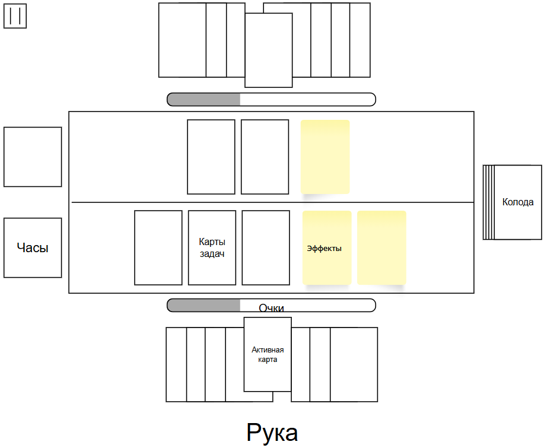
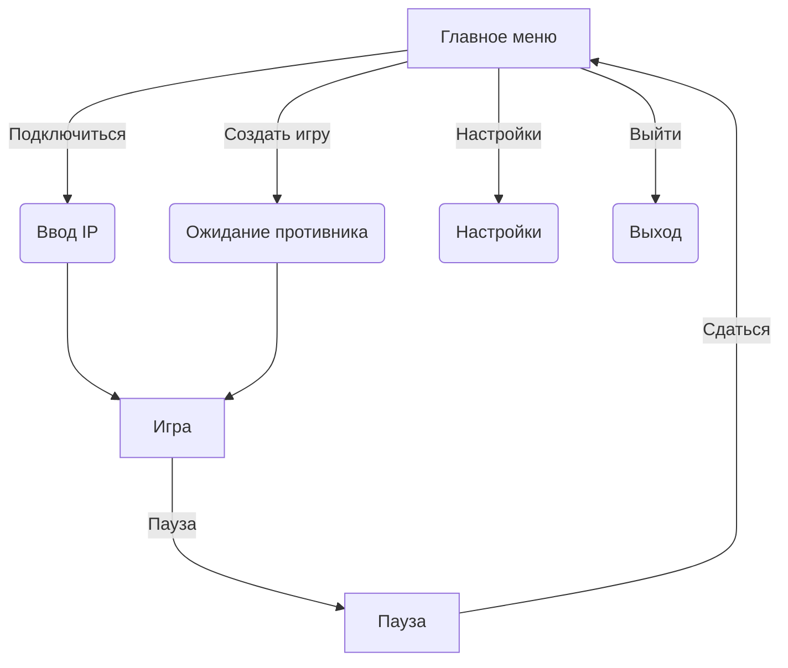

# PythonProject
## TL;DR
Мультиплеерная карточная игра, вдохновлённая студенческим искусством тайм-менеджмента.
## Описание проекта
Проект представляет собой карточную игру про безвозвратно утекающее время. В каждом матче двое игроков противостоят друг другу в умении жонглировать дедлайнами™ и грамотно распределять время.  Игровое поле имеет следующую структуру:

**Колода** - стопка карт, участвующих в игре.
**Рука** - карты, доступные для розыгрыша.
**Игровой стол** - зона для разыгранных карт.
**Карты** бывают двух видов:
1. Карты задач
2. Карты эффектов
**Карты задач.** Представляют собой описание некоторой задачи, например "Написать драфт проекта по совместной разработке".  У задачи есть срок выполнения(через сколько шагов задача "сгорит") и время, требуемое на выполнение(сколько часов нужно на её выполнение). Если игрок выполняет задачу в срок - он получает очки, если просрочивает - теряет.
**Карты эффектов**. Дают бонусы/дебаффы, например, дополнительное время в сутках.
**Часы** показывают количество времени доступного игроку в данный ход.
**Очки** - количество очков у игрока. Игра завершается, если один из игроков сможет набрать определённый уровень очков, либо потерять все.

**Структура хода:**
1. **Начало хода:** Игрок получает в свою руку новые карты.
2. **Розыгрыш карт:**  можно сыграть карту задачи или эффекта — на себя (с целью закрыть задачу и получить больше очков) или на соперника (с целью завалить того делами).
3. **Распределение времени:** Игрок должен распределить доступное ему **время** по актуальным задачам так, чтобы успеть завершить работу над задачей до дедлайна™.
4. **Конец хода:** передача хода сопернику или переход к концу дня. Во втором случае происходит подсчёт очков и начинается новый день.
### GUI
Схема интерфейса. На рёбрах - кнопки, в узлах - меню.

Для реализации планируется использовать библиотеку Pygame. Сетевое взаимодействие планируется организовать с помощью сокетов.
